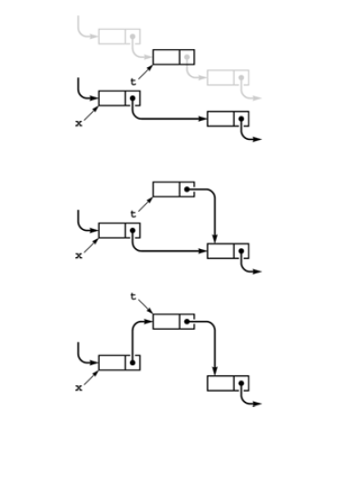
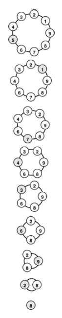

+++

title = "3-Linked Lists"

+++

## Linked List

- A linked list is a set of items where each item is part of a node that also contains a link to a node.

  ​		why is that - just for the sake of traversing the collection of items

  ​		what we lost- quick access capability as compared to array

  ​		what we gain- links provide capability to rearrange quickly

-  aka *self-referent structures* because we define node by nodes.

- Consider **final node** to be:

  - It is a null link that points to no node.
  - It refers to a dummy node that contains no
    item.
  - It refers back to the first node, making the list
    a circular list.

### Creating A Node

````c++
struct node { Item item; node *next;} // Node consist of item and link
typedef node *link;
````

- Memory allocation is central to effectively using linked lists. Because we define one struct but will have many instance of the same struct so we must declare memory when we are declaring that variable of type node.

  `link x = new node;`

  *still work left to do which is assigning the value to node elements<Read Access Before>*

  Memory is reserved at compile time. *often we declare in a way that memory declared at execution time*.

  new operator reserves enough memory for a node returns a pointer to it in x.

- **A way to achieve same using constructor**

  ````c++
  struct node{
      Item item , node *next;
      node( Item x; node *t){
          item =x ; next =t;
      };
  }
  typedef node *link;
  ````

  `link t = new node(x,t);`

  this line not only reserves memory but returns pointer to it t,but also sets item field of the node to value `x` and pointer field to value of `t`.

### Accessing a Node

- we can simply dereference the link.

  item in the node referenced by link `x`

  `(*x).item` of type item.

  `(*x).link` of type link.

- Short hand in C++

  `x->item` and `x->link`

- we so often need to use the phrase "`the node referenced by link x`" that we simply say "`node x`"—the link does name the node.

### Fundamental Operations on Linked list

- #### Linked List Removal

  - 

    ` t = x->next ; x->next = t->next;`

    or simply

    ` x->next = x->next->next;` <you can never access deleted node again>

  - Here we set `t` to the node to be removed. *Later we should ideally remove t as its link still points to list and we don't need it*.

    - *Java already has a Garbage Collector which reclaims references set to null but CPP requires us to delete it manually.*

      `x->next = x->next->next; delete t;`

- #### Linked List Insertion

  - 

  - 

    `t->next = x->next; x->next =t;`

  - Here we insert node t into a list at a position following node x

## Problems

### Josephus Problem (Leader Selection Problem)

To represent people arranged in a circle, we build a circular linked list, with a link from each person to the person on the left in the circle. The integer i represents the ith person in the circle. After building a one-node circular list for 1, we insert 2 through N after that node,
resulting in a circle with 1 through N, leaving x pointing to N. Then, we skip M - 1 nodes, beginning with 1, and set the link of the (M - 1)st to skip the Mth, continuing
until only one node is left.

````c++
#include <iostream.h>
#include <stdlib.h>
struct node {
	int item ; node* next;
    node (int x, node* t){
        item =x; next =t;
    }
};
typedef node *link;
int main(int argc,char *argv[]){
    int i, N =atoi(argv[1]), M = atoi(argv[2]);
    link t = new node(1,0); t->next = t ;//circular link
    link x =t;
    for(i =2 ; i <=N;i++)
        x = (x->next = new node(i,t)); //new node created and x points to it
    while(x!= x->next){ //traversing circular linked list & checks if there is 1 node remaining or not.
        for(i =1; i<M;i++) x= x->next; //jumping to every M-1th node
        x->next = x->next->next; //deleting evry M-1 th node
    }
    cout<< x->item << endl;
}
````



Above image is linked list for N=9 and M=5