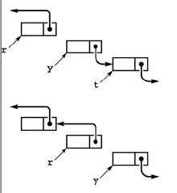
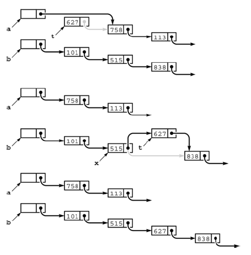

+++

title = "4-Elementary List Processing"

+++

## Elementary List Processing

- Most common bug when using array is out-of bound access. Similarly here reference an undefined pointer or using a pointer that we have changed unknowingly.

- A linked list is either a null link or a link to a node that contains an item and a link to a linked list.

- #### **Traversing a Linked List**

  - let's say `x` is a pointer to first node of a list , the final node has a `null `pointer and `visit` is procedure that takes an item as an argument.

    ` for(link t = x ; t! =0 ; t = t->next) visit(t->item);`

- #### **List Reversal**

  - Maintain a pointer `r` to the portion of the list already processed , and a pointer `y` to the portion of the list not yet seen.

    - Then save a pointer to the node following `y` in `t`, change `y`'s link to point to `r`, and then move `r` to `y` and `y` to `t`,

    

  - ````c++
    link reverse(link x){
        link t, y=x , r=0;
        while (y!= 0){
            t = y->next; y->next= r; r=y; y=t;
        }
        return r;
    }
    ````

- #### **Linked List Sort**

  - Diagram represents unorder list (pointed by a) to transform into ordered one( pointed by  b)

  - *Insertion Sort* -> take first node of unordered list and keep its pointer in `t` (top).Search through b to find the first node `x` with `x->next->item` > `t->item` (or `x->next = NULL`) and insert `t` into the list following `x` (center).

  - These operations reduce length of `a` by a node and increases that of `b` .

  - 

    ````c++
    node heada(0,0); link a = &heada, t = a;
    for(int i=0; i<N;i++)
        t= (t->next = new node(rand() % 1000,0));
    node headb(0,0); link u,x,b = &headb;
    for(t=a->next; t!=0 ; t=u )
    {
        u = t->next;
        for( x=b;x->next !=0 ; x = x->next)
            if(x->next->item > t->item) break;
        t->next = x->next; x->next =t;
    }
    ````

- Above code had very important concept of head which is quite handy while handling tasks like sort. consider situation where you get a new node as input then having a head node helps us. otherwise we will have to duplicate for loop  and testing each time that whether output is empty or node.

  - There is also some advantage of using tails nodes at the end rather than simply using Null nodes.
  - Another use of head nodes is when we want to pass pointers to lists as arguments to functions that may modify the list. so we do not need to inform the calling functions that we have not performed any operations by just returning the pointer to head node.

- #### **Some Famous Conventions used**

  - **Circular,Never empty**

    - *first insert* `head -> next = head`

    - insert `t` after `x` : `t->next = x->next; x->next =t;`

    - remove after `x`: `x->next = x->next->next;`

    - traversal loop: `t=head`

      ` do {... t = t->next;} while( t!= head );`

    - test if one item: `if (head->next == head)`

  - **Head pointer, null tail**

    - *initialize*: `head = 0;`
    - insert `t` after `x`:   `if( x == 0) { head = t ; head->next = 0;} else { t->next = x->next ; x->next= t;}`
    - *remove after `x`*:  `t =  x->next ; x->next = t->next`
    - *traversal loop*: `for( t= head; t!= 0 ; t = t-> next)`
    - test if empty ;` if (head == 0)`

  - **Dummy head node, null tail**

    - *initialize*: `head = new node; head->next =0 `
    - insert `t` after `x`:   ` t->next = x->next ; x->next= t;`
    - *remove after `x`*:  `t =  x->next ; x->next = t->next`
    - *traversal loop*: `for( t= head->next; t!= 0 ; t = t-> next)`
    - test if empty ;` if (head->next == 0)`

  - **Dummy head node, null tail**
    - *initialize*: `head = new node; z = new node ;`

      `head ->next = z; z->next = z;`

    - insert `t` after `x`:   ` t->next = x->next ; x->next= t;`

    - *remove after `x`*:  `t =  x->next ; x->next = t->next`

    - *traversal loop*: `for( t= head->next; t!= z ; t = t-> next)`

    - test if empty ;` if (head->next == z)`

  ### 	Creating a List-Processing Interface

  keep a interface file named `list.h`

  ````c++
  typedef int Item;
  struct node { Item item; node *next; };
  typedef node *link;
  typedef link Node;
  void construct(int);
  Node newNode(int);
  void deleteNode(Node);
  void insert(Node, Node);
  Node remove(Node);
  Node next(Node);
  Item item(Node);
  ````


## Doubly Linked Lists

- We can add multiple links to facilitate moving forward and well as backward.

  - **Removal in a Doubly Linked list **

    

    In a doubly-linked list, a pointer to a node is sufficient information for us to be able to remove it, as diagrammed here.
    Given `t`, we set `t->next->prev` to`t->prev` (center) and `t->prev->next` to `t->next` (bottom).

  - **Insertion in a doubly linked list**

    

    To insert a node into a doubly-linked list, we need to set four pointers. We can insert a new node after a given node (diagrammed here) or before a given node. We insert a given node `t` after another given node `x` by setting `t->next to x->next` and `x->next->prev` to` t`(center), and then setting` x->next` to `t` and `t->prev` to `x` (bottom).