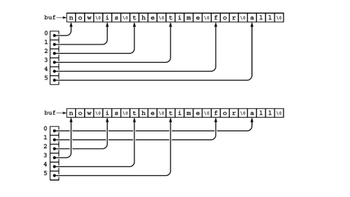
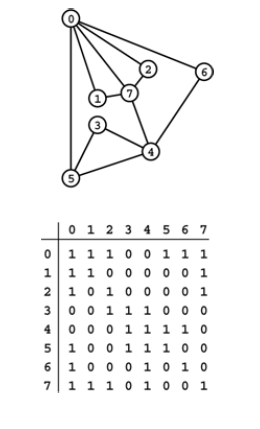
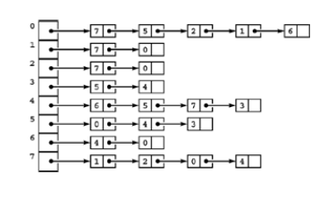

+++

title = "7-Compound Data Structures"

+++

## Compound Data Structures

- Complex structures like array of array (2D Array), arrays of lists, arrays of strings, and so forth are also possible.

- 2D Array is just notation convenience  because ultimately its stored as one-dimensional array

- **Two-dimensional array allocation**

  This function dynamically allocates the memory for a Two-dimensional array, as an array of arrays. We first allocate an array of pointers, then allocate memory for each row. With this function, the statement

  ````c++
  int **a = malloc2d(M,N); // allocates an MxN array of integers
  int **malloc2d(int r , int c)
  {
      int **t = new int*[r];
      for(int i =0 ; i<r ; i++)
          t[i] = new int[c];
      return t;
  }
  ````

- **String Sort**

  When processing string we normally use pointers because they are easy to manipulate

  

  ````c++
  #include <iostream.h>
  #include <stdlib.h>
  #include <string.h>

  int compare ( const void *i , const void *j)
  	{return strcmp(*(char **)i , *(char **)j);} //dereferanced strings for comparisions
  int main()
  {
      const int Nmax = 1000;
      const int Mmax = 10000;
      char* a[Nmax]; int N; // This is pointer to each string
      char buf[Mmac]; int M =0;
      for ( N=0 ; N< Nmax ; N++){
          a[N] = &buf[M];			//Stores address of buffer
          if((cin>>a[N])) break;
          M+=strlen(a[N])+1;
      }
      qsort(a,N,sizeof(char*),compare); //quicksort
      for(int i =0; i<N ;i++)
          cout<< a[i] << endl;
  }
  ````

- A *graph* is a fundamental combinatorial object that is defined simply as a set of objects (called vertices) and a set of connections among the vertices (called edges).

- **Adjacency - matrix graph representation**

  Its just a simple Undirected graph represented using matrix

  

  ````c++
  #include <iostream.h>
  int main()
  {
      int i,j, adj[V][V];
      for (i =0; i<V;i++)
          for (j=0; j<V;j++)
              adj[i][j]=0;
      for(i=0;i<V;i++) adj[i][i]=1; //self connection
      while(cin>>i>>j){
          adj[i][j]=1; adj[j][i]=1;
      }
  }
  ````


- **Adjacency-lists representation of a graph**

  

  ````c++
  #include <iostream.h>
  stuct node {
      item v; node* next;
      node(int x, node* t)
      {
          v=x; next=t;
      }
  };
  typedef node *link;
  int main(){
      int i,j; link adj[V];
      for(i=0;i<V; i++) adj[i]=0;
      while(cin>> i >>j){
          adj[j] = new node(i,adj[j]);
          adj[i] = new node(j, adj[i]);
      }
  }
  ````


