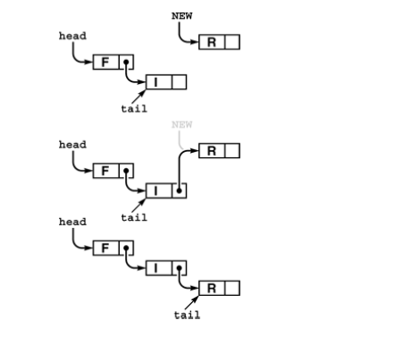

+++

title = "6-FIFO Queues and Generalized Queue"
weight = 6
+++

## FIFO Queues and Generalized Queues

- it is same as pushdown stack except we remove the element that has been in the queue the longest.

- ***FIFO queue ADT interface***

  ````c++
  template <class Item>
  class QUEUE
  {
      private:
      	//Implementation dependant code
      public:
      	QUEUE(int);
      	int empty();
      	void put(Item);
      	Item get():
  }
  ````

  *<u>A FIFO queue is an ADT that comprises two basic operations: insert (put) a new item, and remove (get) the item that was least recently inserted.</u>*

- ***Linked-list queue***

  

  - insert new items at the end
  - to get the item we remove the item from front of the queue

- ***Array Implementation***

  - cumbersome as we have to decrease size and increase it.
  - we can take two pointer in array to achieve same

- ***FIFO queue linked-list implementation***

  ````c++
  template <class Item>
  class QUEUE
  {
      private:
      	struct node
          {
              Item item; node* next;
              node(Item x){
                  item=x ; next=0;
              }
          };
      		typedef node *link;
      		link head,tail;
      public:
      	QUEUE(int)
          { head = 0; }
      	int empty() const
          { return head ==0; }
      	void put(Item x)
          { 	link t = tail;
          	tail new node(x);
           	if(head == 0)
                  head=tail;
           	else t->next = tail;
                   }
      	Item get()
          {	Item v = head->item; link t = head->next;
          	delete head; head =t ; return v;}
  }
  ````

  *Both operation are constant time in either implementation*

- specifically pushdown stacks and FIFO queue are special instances of a more generalized ADT: the *the generalized queue*.

- There are other queue as well like *randomized queue*, *deque ADT*, *Priority Queue*