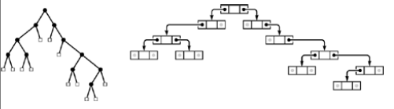
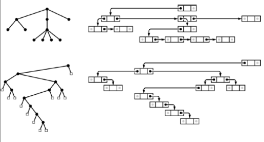

+++

title = "4-Trees"

+++

## Trees

Why trees ?

- trees describe the dynamic properties of algorithms
- we build and use explicit data structures that are concrete realizations of trees.

Types of Trees

- Trees 
- Rooted trees
- Ordered trees
- M-ary trees and binary trees

#### Tree

A tree is nonempty collection of vertices and edges that satisfies certain requirement.

**Vertex** is simple object ( aka node) that can have a name and carry other associated information.

**Edge** is a connection between two vertices.

**Path** in a tree is list of distinct vertices in which successive vertices are connected by edges in the tree.

*Defining property of tree is **Path connecting any two nodes***

Note: - IF there is more than one path between some pair of node then we have a ***graph*** not a ***tree***.

A disjoint set of trees is called a ***forest***.

A ***rooted tree*** is one where we designate one node as the root of the tree. In CS this is referred as tree and use free tree to denote more general tree.

*There is exactly one path between the root and each of the other nodes in the tree and the definition implies no direction on the edges; we normally think of the edges as all pointing away from root.* 

*Each node has exactly one node above it called its parent and one node below it called children.*

**Some more important terminology**

*Nodes with no children are called leaves, or terminal nodes.*

*An ordered tree is a rooted tree in which the order of the children at every node is specified*

If each node must have a specific number of children appearing in a specific order then we here an M-ary tree.

*A binary tree is an ordered tree consisting of two types of node : external nodes with no children and internal nodes with exactly two children* 

### Binary Tree

A Binary tree is either an external node connected to a pair of binary tree , which are called the left subtree and the right subtree of that node.

````c++
struct node { Item item; node *l,*r;};
typedef node *link;
````



Right now all the basics structures is designed to go down below the leaves but not up. We can add third link that is connected to parent node.

## M-ary Tree

An M-ary tree is either an external node or an internal node connected to an ordered sequence of M trees that are also M-ary trees.

Represented as M named links or as arrays of M links.

## Tree

A tree(also called as an ordered tree) is a node(called the root) connected to a sequence of disjoint trees. Such a sequence is called a forest.

Here # of children is not fixed so that is the reason we use linked list to achieve it. Its also known as `general tree`.



There is a one-to-one correspondence between binary trees and ordered forests.

We can represent any forest as a binary trees by making the left link of each node point to its leftmost child, and the right link of each node point to its siblings on the right.

## Rooted or (unordered tree)

A rooted tree is a node connected to a multiset of rooted trees.

We can say they are ordered trees where order of children doesn't matter.

[Further study *the tree isomorphism problem*]

### Graph

Graph is a set of node together with a set of edges that connect pairs of distinct nodes.

we can think of starting at some node and following edge to the constituent node for the edge, then following an edge form that node to another node, and so on.

*A sequence of edges leading from one node to the other in this manner is called as* **simple path.**

*Connected Graphs* : A graph is connected if there is *simple path* connecting any pair of nodes.

A path that is simple except that the first and final nodes are the same is called a **cycle**


*Every tree is a graph*,which graphs are tree?

- G has N-1 edges and no cycles.
- G has N-1 edges and is connected
- Exactly one simple path connects each pair of vertices in G.
- G is connected, but does not remain connected if any edge is removed.
- 

