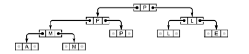
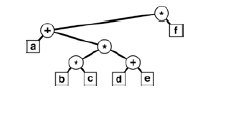

+++

title = "7-Recursive Binary TreeAlgo"

+++

## Recursive Binary-Tree Algorithms

**Computation of tree Parameters**

````c++
int count(link h){
    if(h==0) return 0;
    return count(h->l) + count(h->r)+1;
}
int height(link h){
    if(h==0) return -1;
    int u = height(h->l), int v = height(h->r);
    if(u>v) return u+1; else return v+1;
}
````

**Quick Tree Print function**

````c++
void printnode(Item x,int h){
    for (int i=0;i<h;i++) cout<<" ";
    cout<<x<<endl;
}
void show(link t,int h){
    if(t==0) { printnode('*',h); return;}
    show(t->r,h+1);
    printnode(t->item,h);
    show(t->l,h+1);
}
````

**Find the maximum by building a tournament**

Its binary tree where the item in every internal node is a copy of the larger of the items in its two children. and in particular item at the root is biggest of all of them.



**Construction of tournament**

````c++
struct node
{
    Item item; node *l,*r;
    node(Item x)
    {item = x; l= 0; r=0}
};
typedef node* link;
link max(Item a[],int l,int r){
    int m = (l+r)/2;
    link x = new node(a[m]);
    if(l==r) return x;
    x->l = max(a,l,m);
    x->r = max(a,m+1,r);
    Item u = x->l->item, v = x->r->item;
    if(u>v)
        x->item = u; else x->item = v;
    return x;
}
````

**Parse Tree**

Tree constructed for expression i.e. prefix `*+a**bc+def`



**Construction of a parse tree**

````c++
char *a; int i; struct node{
    Item item; node*l,*r;
    node(Item x){
        item = x; l=0 ;r=0;
    }
};
typedef node* link;
link parse(){
    char t = a[i++]; link x = new node(t);
    if((t=='+')|| (t=='*'))
    { x->l = parse(); x->r = parse();}
    return x;
}
````

