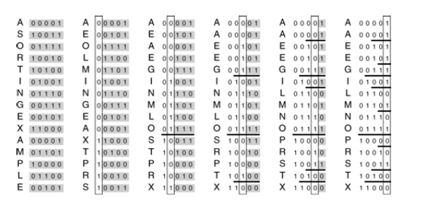

+++

title = "2-Binary Quicksort"

+++

### Binary Quicksort

Suppose we can rearrange the records of a file such that all those whose keys begin with `0` bit come before all those keys begin with a `1` bit. Then we can use a variant of quicksort to recursively sort the file. To rearrange it scan from left to find a key that starts with a 1 bit, scan from right to find a key that starts with a `0` bits, exchange and continue until the scanning pointers cross. *Radix exchange sort*

````c++
template <class Item>
void quicksortB(Item a[], int l, int r, int d){
    int i = l, j = r;
    if(r<=l || d>bisword) return;
    while(j!= i){
        while(digit(a[i],d) == 0 && (i<j)) i++;
        while(digit(a[j],d) == 1 && (j>i)) j--;
        exch(a[i],a[j]);
    }
    if(digit(a[r],d) == 0) j++;
    quicksortB(a,l,j-1,d+1);
    quicksortB(a,j,r,d+1);
}
template <class Item>
void sort(Item a[],int l,int r)
	{ quicksortB(a,l,r,0);}
````

There is a potential problem with binary quicksort in practical situations : Degenerate Partitions (partitions with all keys having the same value for the bit being used) can happen frequently. It is not uncommon to sort small numbers(with many leading zeros).

When the keys are truly random bits, only about $\lg N$ bits / key are examined and that could be many fewer than the number of bits in the keys.

Binary Quicksort doesn't work well when files contains huge amounts of duplicates keys.

