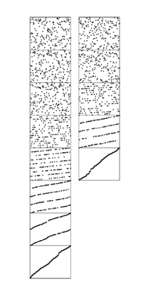

+++

title = "5-LSD Radix sort"

+++

### LSD Radix Sort

Its hard convince ourselves that sorting actually happens when we look from right to left. in fact it doesn't work at all unless the sort method used is *stable.*

Once *stability* has been identified as being significant, a simple proof that LSD radix sorting works is easy to articulate.

Proof : after putting keys into order on their *i* trailing bytes ( in a stable manner ), we know that any two appear in proper order (on the basis of bits so far examined ) in the file either because the first of their i trailing bytes are different, in which case the sort on that byte put them in the proper order, or because the first of their `i`th trailing bytes are same, in which case they are in proper order because of stability. Stated another way, if `w-i` bytes that have not been examined for a pair of keys are identical , any difference between the keys is restricted to the i bytes already examined , and the keys have been properly ordered, and will remains so because of stability.

If , on the other hand, the `w-i` bytes that have not been examined are different the `i` bytes already examined do not matter, and a later pass will correctly order the pair based on the more significant differences.

***LSD radix sort***

Based on key-indexed counting on bytes in the words.

````c++
template <class Item>
void radixLSD(Item a[], int l ,int r)
{ static Item aux[maxN];
  for(int d = bytesword-1;d>=0;d--)
  {
      int i, j, count[R+1];
      for(j = 0; j <R; j++) count[j] = 0;
      for(i = l; i<=r ; i++)
          count[digit(a[i],d)+1]++;
      for(j=1;j<R;j++)
          count[j]+= count[j-1];
      for(i = l; i<=r ; i++)
          aux[count[digit(a[i],d)]++] = a[i];
      for(i = l; i<=r ; i++) a[i]=aux[i];
  }
}
````

LSD radix sorting is the method used by old computer-card-sorting machines.

Dynamic Characteristics of LSD radix sort



It is typically difficult to apply the LSD approach to a string-sorting application because of variable-length keys. For MSD sorting, it is simple enough to distinguish keys according to their leading bytes, but LSD sorting is based on a fixed-length key, with the leading keys getting involved for only the final pass.

