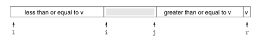

+++

title = "1-The Basic Algorithm"

+++

### The Basic Algorithm

Its a divide and conquer method for sorting.

It partitions an array into two parts, then sorting parts independently.

The crux of method is partitioning process, which rearranged the array to make the following three conditions hold :

- The element `a[i]` is in its final place in the array for some `i`.
- None of elements in `a[l] ,....,a[i-1]` is greater than `a[i]`.
- None of elements in `a[i+1] ,....., a[r]` is small than `a[i]`.

````c++
template <class Item>
    void quicksort(Item a[] , int l, int r){
    if(r<= l) return ;
    int i = partition(a,l,r);
    quicksort(a,l,i-1);
    quicksort(a,i+1,r);
}
````

We use following general strategy to implement partitioning. First, we arbitrarily choose `a[r]` to be the partitioning element. Next , we scan from the left end of array until we find an element greater then the partitioning element,  and we scan from the right end of the array until we find an element less than the partitioning element.

The two elements that stopped the scans are obviously out of place in the final partitioned array, so we swap them.



Here v is partitioning element, `i` is left pointer and `j` is right pointer.

it is best to stop the left scan for the elements greater than or equal to the partitioning element and the right scan for elements less than or equal to the partitioning element, even though this policy creates unnecessary exchanges for the elements with same value (Reason why ? )

When the pointer cross all we have to do is complete the partitioning by exchanging `a[r]` with the leftmost element of the right sub file.

*Note: The inner loop of quicksort increments a pointer and compares an array element against a fixed value. This simplicity is what makes quicksort quick:*

````c++
template <class Item>
int partition(Item a[] , int l , int r ){
    int i = l-1 , j=r ; Item v = a[r];
    for(;;){
        while (a[++i] < v); //explicit test for checking whether partioning element is the smallest element in array
        //we could have used a sentinel here.
        //no need to check for largest element cause scanning will stop in one pass.
        while (v <a[--j]) if(j==l) break;
        if(i>=j) break;
        exch(a[i],a[j]);
    }
    exch(a[i],a[r]);
    return i;
}
````

Partition process is not stable , because any key might be moved past a large number of keys equal to it.

How we can deal with equal keys.

- have both pointers stop on such keys. ( ***Best***)
- have one pointer stop and other scan over them
- or have both pointers scan over them.

Why 1 st one is best. Because this method tends to balance the partitions in the presence of many duplicate keys, whereas others perform badly.

