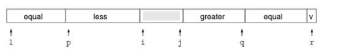

+++

title = "6-Duplicate Keys"

+++

### Duplicate Keys

files with large numbers of duplicate sort keys arise frequently in applications.

There is potential for improvement since quicksort operated on already sorted array does unnecessary work.

Partition the file into three parts, one each for keys smaller than, equal to, and larger than the partitioning element.

Accomplishing this partitioning is more complicated than the two way partitioning that we have used. It was a classical programming exercise popularized by Dijkstra as the *Dutch National Flag* problem. because the three possible key categories might correspond to three colors on the flag.

For quicksort, we add constraint that a single pass through the file must do the job - an algorithm that involves two passes through the data would slow down quicksort by a factor of two, even if there are no duplicate keys at all.


A clever method invented by *Bentley and McIlroy* in 1993 for three way partitioning works by modifying partitioning scheme as follows:

- keep keys equal to the partitioning element that are encountered in the left subfile at the left end of the file, and keep keys equal to partitioning element that are encountered in the right subfile at the right end of the file.

 

Then, when the pointers cross and the precise location for equal keys is known, we swap into position all the item with keys equal to the partitioning element.

It has 2 implications

1. method works even if there are no duplicate keys as there is no extra overhead.
2. method is linear time when there is only a constant number of key values.

Each partitioning phase removes from the sort all the keys with the same value as the partitioning element, so each key can be involved in at most a constant number of partitions.

````c++
template <class Item>
int operator==(const Item& A, const Item& B)
{return !less(A,B) && !less(B,A);}
template <class Item>
void quicksort(Item a[], int l , int r){
    int k; Item v = a[r];
    if(r<= l) return;
    int i = l-1,j=r , p = l-1,q=r;
    for(;;){
        while(a[++i]<v);
        while(v<a[--j]) if (j==l)break;
        if(i>=j) break;
        exch(a[i],a[j]);
        if(a[i] == v) {p++; exch(a[p],a[i]);}
        if(v == a[j]) {q--;exch(a[q],a[j]);}
    }
    exch(a[i],a[r]); j = i-1;i = i+1;
    for(k = l ; k<= p; k++,j--) exch(a[k],a[j]);
    for(k = r-1; k>=q; k--,i++) exch(a[k],a[i]);
    quicksort(a,l,j);
    quicksort(a,i,r);
}
````

