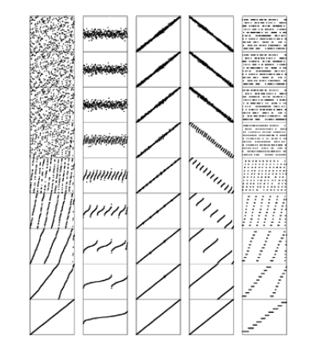

+++

title = "6-Performance characteristics of mergesort"

+++

### Performance Characteristics of Mergesort

Most of the headroom for improvement in mergesort is from improving the inner `for` loop.

In addition to discussed improvements, we might achieve further gains by ensuring that the smallest elements in the two arrays are kept in simple variables or machine registers, to avoid unnecessary array accesses. Thus inner loop only works in comparisons.

Total no. of instruction in inner loop quicksort are little more than merge sort but the instruction are executed only $N\lg N$ times, where quicksort's are executed 39% more often.

Sorting of various types of files with bottom-up mergesort.

<u>Random, Gaussian, nearly ordered,nearly reverse ordered, randomly ordered with 10 distinct key value.</u>

See sort performance is dependent on size of input not the way the input comes in.