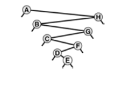

+++

title = "6-Performance Characteristics of BSTs"

+++

### Performance Chracterstics of BSTs

Running time of algorithm on BSTs are dependent on the shapes of trees. In best case, the tree could be perfectly balanced, with about $\lg N$ nodes between root and each of external nodes, but in worst case there could be $N$ nodes on search path.

On average case it performs quite well since random inputs create tree which may not be perfectly balanced but enough so that algorithms perform well.

*Property :* Search hits require about $ 2 \lg N \approx 1:39 \lg N$ comparisons, on the average, in a BST built from N random keys.

*Property :* Insertions and search misses require about $ 2 \lg N \approx 1:39 \lg N$ comparisons, on the average, in a BST built form N random keys.

*Property :* In the worst case, a search in a binary search tree with N keys can require N comparisons.

Some worst case BSTs :-)

