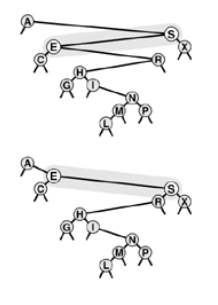

+++

title = "8-Insertion at root in BSTs"

+++

### Insertion at the Root in BSTs

In standard implementation of BSTs each new inserted node goes to some external node via recursion. But now we wish to put that node at the root so new nodes are at the root of the tree it proposes a problem or breaking BST property but there is way to prevent it.

Recursive solution is known as `rotation` , a fundamental transformation on trees. It essentially interchanges role of root's children in a tree while still preserving the BST ordering.

Right Rotation involves root and the left child. The rotation puts root on the right, essentially reversing the direction of left link of the root; after the rotation, it points from root to the left child; after rotation it points from old left child( the new root ) to the old root( the right child of the new root.)

Now to make rotation work, is to copy the right link of the left child to be the left link of the old root. This link points to all the nodes with keys between the two nodes involved in the rotation.

Finally, the link to the old root has to be changed to point to new root.

for left rotation swap roles of "left" and "right in above explanation".



*Right rotation*

Note : A rotation is a local change, involving only three links and two nodes, that allow us to move nodes around in trees without changing the global ordering property.

````c++
void rotR(link& h)
	{link x = h->l ; h->l = x->r ; x->r = h ; h = x;}
void rotL(link& h)
	{link x = h->r; h->r = x->l; x->l = h; h=x; }
````

**Root insertion in BSTs**

````c++
private:
	void insertT(link& h, Item x)
    {
        if(h == 0) { h = new node(x); return;}
        if (x.key() < h->item.key())
        	{ insertT(h->l,x); rotR(h);}
        else { insertT(h->r,x); rotL(h);}
    }
public:
	void insert(Item item)
    {insertT(head, item); }
````

