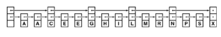

+++

title = "5 Skip Lists"

+++

### Skip Lists

It is based on a randomized data structure is almost certain to provide near optimal performance for all the basic operations for the symbol table ADT that we have been considering.

Th underlying data structure is developed by Pugh in 1990, is called skip list. It uses extra links in the nodes of a linked list to skip through large portions of a list at a time during search.

e.g. A two-level linked list.



*Definition :* *A skip list is an ordered linked list where each node contains a variable number of links, with the $i^{th}$ links int the node implementing singly linked lists that skip the nodes with fewer than $i$ links.*

Memory management is the most complicated aspect of skip lists. For moment it suffices to note that we can access the node that follows node t on (k+1)st level in the skip list by accessing `t->next[k]`.

**Searching in Skip Lists**

````c++
private:
	Item searchR(link t, Key v, int k)
    {
        if(t==0) return nullItem;
        if(v==t->item.key()) return t->item;
        link x = t->next[k];
        if((x==0) || (v<x->item.key()))
        {
            if(k==0) return nullItem;
            return searchR(t,v,k-1);
        }
        	return searchR(x,v,k);
    }
public:
	Item search(Key v)
    {return searchR(head,v,lgN);}
````

**Skip-List data structures and constructor**

Nodes in skip lists have an array of links, so the constructor for`node` needs to allocate the array and set all links to 0.

The constant `lgMax` is the max number of levels that we will allow in this list : It might be set to five for tiny lists, or to 30 for huge lists. The variable N keeps the number of items in the list, as usual, and `lgN` is the number of levels. An empty list is a head node with `lgNmax	` links, all set to 0, with N and `lgN` also set to 0.

````c++
private:
	struct node
    { Item item[;;] node **next; int sz;
      node(Item x,int k)
      { item = x; sz =k; next = new node*[k];
        for(int i = 0; i<k ; i++) next[i] = 0;}
    };
	typedef node *link;
	link head;
	Item nullItem;
	int lgN;
public:
	ST(int)
    { head = new node(nullItem, lgNmax); lgN =0;}
````

**Insertion in skip lists**

we generate new j-link node with probability $\frac{1}{2^j}$, then follow the search path precisely . but link in the new node when we move down to each of the bottom $j$ levels.

````c++
private:
	int randX()
    { int i,j,t = rand();
      for(i = 1,j = 2; i<lgNmax; i++, j+=j)
    	if(t>RAND_MAX/j) break;
      if(i>lgN) lgN = i;
      return i[;;]
    }
	void insertR(link t, link x, int k)
    { Key v = x->item.key(); link tk = t->next[k];
    if((tk ==0 )|| (v < tk->item.key()))
    {
        if(k<x->sz)
        { x->next[k] = tk; t->next[k] = x;}
        if (k==0) return;
        insertR(t,x,k-1); return;
    }
     insertR(tk,x,k);
    }
public:
	void insert(Item v)
    { insertR(head, new node(v,randX()), lgN); }
````

*Property :* Search and insertion in a randomized skip list with parameter t require about $(t \log_t N)/2 = (t/(2\lg t))\lg N$ comparisons, on the average.

*Property :* Skip lists have $(t/(t-1)) N$ links on the average.

**Removal in skip lists**

````c++
private:
	void removeR(link t, Key v, int k)
    { link x = t->next[k];}
    if(!(x->item.key()<v)){
        if(v==x->item.key())
        { t->next[k] = x->next[k];}
        if(k==0) { delete x; return;}
        removeR(t,v,k-1); return;
	}
	removeR(t->next[k],v,k);
}
public:
	void remove(Item x)
    { removeR(head, x.key(), lgN); }
````

