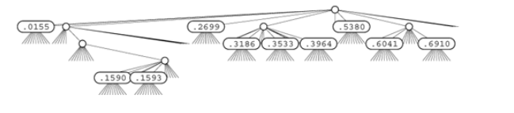
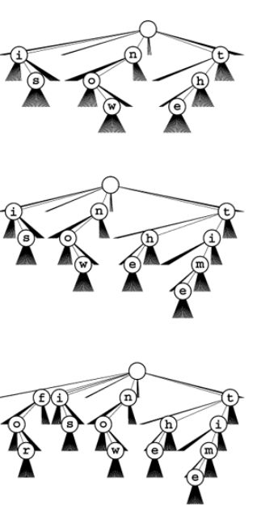
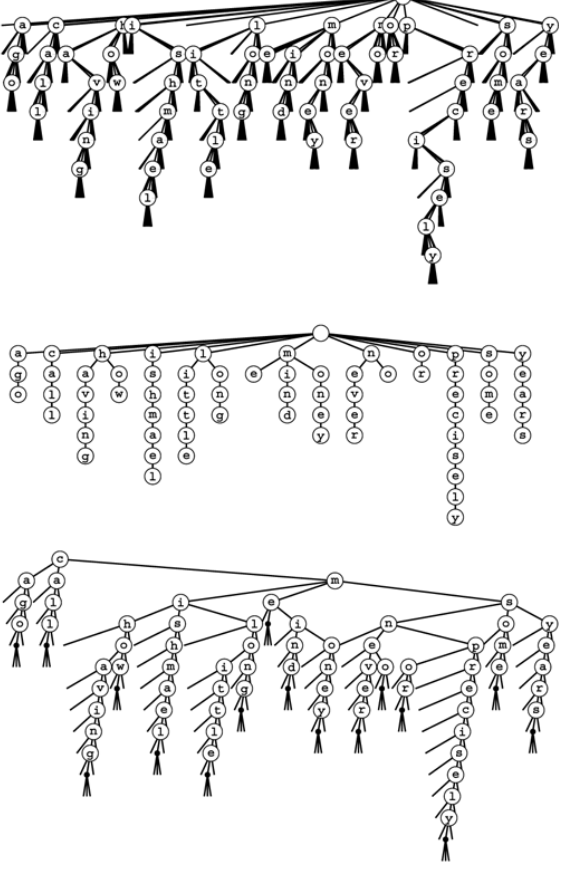

+++

title = "4-Multiway Tries and TSTs"

+++

### Multiway Tries and TSTs

Just like radix sort we could examine `r` bits at a time in radix search to get a performance gain of `r` times but its comes with a cost of using tree nodes with $R = 2^r$ links, and can lead to space wastage.

In binary tries we had 2 links(for `0` bit and `1` bit) for 1 bit comparison, similarly we now need the $2^r$ links for $r$ bits comparison. We store keys at the leaves and we traverse the path according to search key and if we reach a null link we will have reached search miss or we get a search hit.

*Example of R-way trie for base-10 numbers*



Before doing the full symbol table implementation with multiple nodes type, we begin study of multiway tries by concentrating on *existence-table* problem.

*Definition* : The existence trie corresponding to a set of keys is defined recursively as follows : The trie for an empty set of keys is a null link; and the trie for a non-empty set of keys is an internal node with links referring to the trie for each possible key digit, with the leading digit considered to be removed for the purpose of constructing the subtrees.

Example : *26-way trie for the words `now` , `is` and `the` has nine nodes and following insertion of `time` and `for`.*



*Definition 2:* A multiway trie is multiway tree that has keys associated with each of its leaves, defined recursively as follows: The trie for an empty set of keys is a null link; the trie for a single key is a leaf containing that key; and the trie for a set of keys of cardinality greater than one is an internal node with links referring to tries for keys with each possible digit value, with the leading digit considered to be removed for the purpose of constructing the subtree.

There is a important assumption here that no key is prefix of other key.

**Existence-trie search and insertion**

````c++
private:
	struct node
    { node **next;
    	node()
        { next = new node*[R];
          for(int i = 0; i < R; i++) next[i] = 0; }
    };
	typedef node *link;
	link head;
	Item searchR(link h, Key v, int d)
    {
        int i = digit(v,d);
        if(h==0) return nullItem;
        if(i == NULLdigit)
        	{ Item dummy(v); return dummy; }
        return searchR(h->next[i], v, d+1);
    }
	void insertR(link& h, Item x, int d)
    {
        int i = digit(x.key(), d);
        if(h == 0) h = new node;
        if(i == NULLdigit) return;
        insertR(h->next[i], x, d+1);
    }
public:
	ST(int maxN)
    { head = 0; }
	Item search(Key v)
    { return searchR(head, v, 0); }
	void insert(Item x)
    { insertR(head, x, 0); }
````

*Property :* Search or insertion in a standard R-ary trie requires about $\log_R N$ byte comparisons on the average in a tree built from N random bytestrings. The number of links in an R-ary trie built form $N$ random keys is about $\frac{RN}{\ln R}$. The number of byte comparisons for search or insertion is no more than the number of bytes in the search key.

*In a **TST** (Ternary Search Trie)*, each node has a character and three links, corresponding to keys whose current digits are less than, equal to, or greater than the node's character. TST are efficient representation for Multiway trie.

In the standard representation of tries, trie nodes are represented by R+1 links, and infer character represented by each non-null link by its index.

Making a comparisons 26-way trie, the abstract trie with null links removed and TSTs. Top two assuming no prefix strings.

`call me ishmael some years ago never mind how long precisely having little or no money`



The search algorithm for TSTs is so straightforward as nearly to write itself; the insertion is more complicated but mirrors directly insertion in existence tries.

TSTs correspond to three-way sorting in the same way that BSTs correspond to quicksort, tries correspond to binary quicksort, and M-way tries corresponds to M-way radix sorting.

**Existence-TST search and insertion**

````c++
private:
	struct node
    { Item item; int d; node *l,*m,*r;
      node(int k)
      { d = k; l = 0; m = 0; r = 0;}
    };
	typedef node *link;
	link head;
	Item nullItem;
	Item searchR(link h, Key v, int d)
    { int i = digit(v,d);
      if(h==0) return nullItem;
      if(i == NULLdigit)
      { Item dummy(v); return dummy;}
      if(i < h->d) return searchR(h->l , v, d);
      if(i == h->d) return searchR(h->m, v, d+1);
      if(i > h->d) return searchR(h->r, v, d);
    }
	void insertR(link& h, Item x, int d)
    {
        int i = digit(x.key(),d);
        if( h == 0 ) h = new node(i);
        if( i == NULLdigit) return;
        if(i < h->d) return searchR(h->l , v, d);
        if(i == h->d) return searchR(h->m, v, d+1);
        if(i > h->d) return searchR(h->r, v, d);
    }
public:
	ST(int maxN)
    {head = 0; }
	Item search(Key v)
    { return searchR(head, v, 0);}
	void insert(Item x)
    { insertR(head, x, 0);}
````

*Property :* A search or insertion in a full TSTs requires time proportional to the key length. The number of links in a TSTs is at most three times the number of characters in all the keys.

Prime virtue of using TSTs is that they adapt gracefully to irregularities in search keys that are likely to appear in practical applications. There are two main effects.

1. Keys in practical application come from large character sets
2. Keys in practical application, perhaps using only letters in one-part of the key, only digits in another part of key, and special characters as delimiters.

advantage of TST-based search over many algorithms is that search misses are likely to be extremely efficient, even when the keys are long.

**Partial-match searching in TSTs**

````c++
private:
	char wordmaxW;
	void matchR(link h, char *v, int i)
    {
        if(h==0) return;
        if((*v == 0) && (h->d == 0))
        {wordi = 0; cout<<word<<" ";}
        if((*v == '*') || (*v == h->d))
        {wordi = h->d; matchR(h->m, v+1, i+1);}
        if((*v == '*') || (*v < h->d))
		matchR(h->l, v, i);
        if((*v == '*') || (*v > h->d))
            matchR(h->r, v, i);
    }
public:
	void match(char *v)
    { matchR(head, v, 0);}
````

