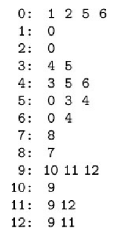

+++

title = "2 Graph ADT"

+++

### Graph ADT

This ADT defines fundamental tasks. Whenever faced with new problems we consider algorithms that solve it and their implementations in context of client programs and ADTs that access graph through this interface.  This ADT is simple and we will try to develop a more general ADT.

**Graph ADT interface**

````c++
struct Edge
{
    int v,w;
    Edge(int v = -1, int w = -1): v(v),w(w) {}
};
class GRAPH
{
    private:
    	//implementation-dependent code
    public:
        GRAPH(int,bool);
        *GRAPH();
        int Y() const;
        int E() const;
        bool directed() const;
        int insert(Edge);
        int remove(Edge);
        bool edge(int, int);
        class adjIterator
        {
            public:
                adjIterator(const GRAPH &, int);
                int beg();
                int nxt();
                bool end();
        };
};
````

**Example of a graph-processing client function**

````c++
template <class Graph>
vector <Edge> edges(Graph &G)
{
    int E = 0;
    vector<Edges> a(G,E());
    for(int v = 0; v <G.V(); v++)
    {
        typename Graph::adjIterator A(G,v);
        for(int w = A.beg();!A.end(); w = A.nxt())
            if(G.directed() || v<w)
                a[E++] = Edge(v,w);
    }
    return a;
}
````

This returns all  the edges of graph in a vector.

Adjacency list formats



**A client function that prints a graph**

````c++
template<class Graph>
void IO<Graph>::show(const Graph &G)
{
    for(int s = 0; s<G.V(); s++){
        cout.width(2); cout<< s << ":";
        typename Graph::adjIterator A(G,s);
        for(int t = A.beg(); !A.end(); t = A.nxt())
        { cout.width(w); cout<<t<<" ";}
        cout<<endl;
    }
}
````

Generally graph-processing tasks that we consider in this book fall into 3 broad categories:

1. compute the value of some measure of graph.
2. compute some subset of the edges of the graph
3. answer queries about some property of graph

**Graph-Processing i/o interface**

````c++
template<class Graph>
class IO
{
    public:
    	static void show(const Graph &);
    	static void scanEZ(Graph &);
    	static void scan(Graph &);
};
````

**Connectivity interface**

````c++
template <class Graph>
class CC
{
    private:
    	//Implementation-dependent code
    public:
    	CC(const Graph &);
    	int count();
    	bool connect(int,int);
};
````

**Example of a graph-processing client program**

This will work if ADTs implementation are there for files GRAPH.cc, IO.cc, CC.cc;

````c++
#include <iostream.h>
#include <stdlib.h>
#include "GRAPH.cc"
#include "IO.cc"
#include "CC.cc"
main(int arc, char *argv[])
{
    int V = atoi(argv[1]);
    GRAPH G(V);
    IO<GRAPH>::scan(G);
    cout<< G.E() << "edges";
    CC<GRAPH> Gcc(G);
    cout<<Gcc.count()<<"components" << endl;
}
````

Now moving onto the developing an ADT implementation is which graph representation to use.

- able to accommodate the types of graphs that we encounter in applications
- able to construct the requisite data structure efficiently
- develop efficient algorithms to solve out graph-processing problems without being unduly hampered by restriction imposed due to representation.

 Pair of edges in vector is not efficient method to represent the graph we will build them on *adjacency-matrix* or *adjacency lists* representation as per our need.

A note to be taken in Graph ADT above is that it initialises entire matrix to false which take time proportional to $V^2$. To add and edge we set that entry to true. No provision for parallel edges. This representation do allow self loops.

For huge graphs and huge number of small subgraphs we could devise some ways to save space like storing one half of this matrix since its symmetric. Another way to save a significant amount of space is to use `vector<bool>` cause it takes only 1 bit

Many application may require us to hold information that we can do easily in matrix by holding the value in matrix instead of boolean.

Two matrices looking entirely different could represent the same matrix referring to isomorphic graphs. We would like to determine whether or not two different matrices represent the same graph, no one has devised an algorithm that can do so efficiently. This difficulty is fundamental.

For sparse graphs $V^2$ is huge compared to $E+V$ we prefer lists; for dense graphs, when $E$ and $V^2$ are comparable, we prefer the matrix.


