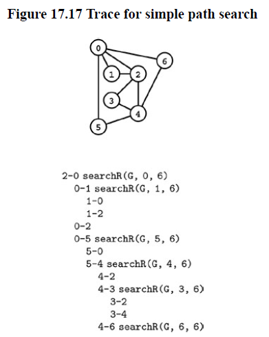

+++

title = "7-Simple Euler and Hamilton Paths"

+++

### Simple, Euler, and Hamilton Paths

**Program 17.16 Simple Path Search**

````c++
template <class Graph> class sPATH
{
    const Graph &G;
    vector<bool> visited;
    bool found;
    bool searchR(int v,int w)
    {
        if(v==w) return true;
        visited[v] = true;
        typename Graph::adjIterator A(G,v);
        for(int t = A.beg(); !A.end(); A.nxt())
            if(!visited[t])
                if(searchR(t,w)) return true;
        return false;
    }
    public:
    	sPATH(const Graph &G, int v, int w) :
    		G(G), visited(G.V(), false)
            {found = searchR(v,w); }
    	bool exists() const
        { return found; }
};
````

Problem of finding the path in a graph takes us away from local properties such as existence of edges/ degree of vertices to global properties that tell us about a graph's structure.

The most basic such property is whether two vertices are connected. If they are then finding path in between them.

 Trace for finding path from 2 to 6



**Simple Path :** Given two vertices, is there a simple path in the graph that connects them  ?

Program 17.16 is direct solution that finds path and based on dfs. How we can make it print the path.

- Add a statement to print t-v just after the recursive call in searchR finds a path from $t$ to $w$
- Switch w and v in the call on searchR in the constructor.

First change prints the path in reverse order and second reverses that order.

*Property 17.2 :* We can find a path connecting two given vertices in a graph in linear time.

In worst case it checks all entries in the adjacency matrix exactly once.

**Hamilton Path :** Given two vertices, is there a simple path connecting them that visits every vertex in the graph exactly once ? If the path is from a vertex back to itself, this problem is known as the Hamilton Tour.

**Program 17.17 Hamilton Path**

````c++
bool searchR(int v, int w, int d)
{
    if(v==w) return (d==0);
    visited[v] = true;
    typename Graph::adjIterator A(G,v);
    for(int t = A.beg(); !A.end(); t = A.nxt())
        if(!visited[t])
            if(searchR(t,w, d-1)) return true;
    visited[v] = false;
    return false;
}
````

**Property 17.3** *A recursive search for a Hamilton tour could take exponential time.*

*Proof :* consider a graph where vertex V-1 is isolated and the edges, with the other V-1 vertices, constitutes a complete graph. Above program will never find a Hamilton path, but it is easy to see it will examine $(V-1)!$ paths in complete graph, all of which involve $V-1$ recursive calls. Total calls $V!$. or $(V/e)^V$, which is higher than any constant to the Vth power.

For checking there is a Hamilton Path we can directly check whether there is a Simple Path.

*Factorial-time algorithms are too slow*

If we could process a graph with 15 vertices in 1 second, it would take 1 day to process a graph with 19 vertices , over 1 year for 21 vertices, and over 6 years for 23 vertices. Faster computer don't help much, either.

**Euler Path :** Is there a path connecting two given vertices that uses each edge in the graph exactly once ? The path need not be simple - vertices may be visited multiple times. If the path is from a vertex back to itself, we have a Euler tour problem. Is there a cyclic path that uses each edge in the graph exactly once ?

*Property 17.4 :* A graph has an Euler tour if and only if it is connected and all its vertices are of even degree.

*Proof :* First to reach all edges we need it to be connected and even because if we enter a node we want to leave on different edge.

*Corollary :* A graph has an Euler path if an only if it is connected and exactly two of its vertices are of odd degree.

*Property 17.5* We can find an Euler tour in a graph, if one exists, in linear time.

**Program 17.18 Euler path existence**

````c++
template < class Graph> class ePATH
{
    Graph G;
    int v,w;
    bool found;
    STACK<int> S;
    int tour(int v);
 public:
    ePATH(const Graph &G, int v,int w):
    G(G), v(v), w(w) {
        DEGREE<Graph> deg(G);
        int t = deg[v]+deg[w];
        if((t%2) != 0 ) { found = false; return;}
        for(t = 0; t <G.V(); t++)
        	if((t!=v) && (t!=w))
                if((deg[t] %2)!=0)
                {found = false; return;}
        found = true;
    }
    bool exists() const
    { return found;}
    void show();
};
````

**Program 17.19 Linear-time Euler Path (hard to understand )**

````c++
template <class Graph>
int ePATH<Graph>::tour(int v)
{
    while (true)
    { 	typename Graph::adjIterator A(G, v);
        int w = A.beg(); if (A.end()) break;
        S.push(v);
        G.remove(Edge(v, w));
        v=w;
	}
	return v;
}
template <class Graph>
void ePATH<Graph>::show()
{
    if (!found) return;
    while (tour(v) == v && !S.empty())
    	{ v = S.pop(); cout << “-” << v; }
    cout << endl;
}
````

