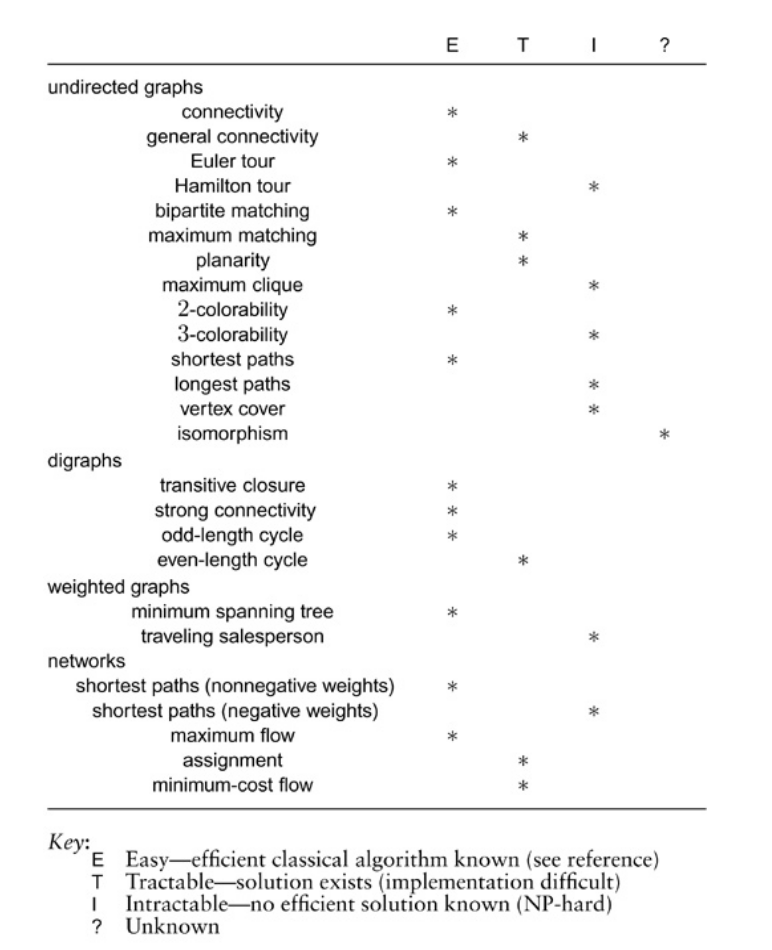

+++

title = "8-Graph Processing Problems"

+++

### Graph Processing Problem

Short description of problems.

- **Simple connectivity** Is a given graph connected ? or Is there a path connecting every pair of vertices ? Is there a cycle in the graph, or is it a forest ? Given two vertices, are they on cycle.

- **Strong connectivity in digraphs** Is there a *directed* path connecting every pair of vertices in a digraph ? Given two vertices, are they connected by directed path in both direction ( are they on directed cycle)

- **Minimum spanning tree** In a weighted graph, find a min-wt. set of edges that connects all the vertices. Oldest and well known problem.

- **Single-source shortest paths** What are the shortest paths connecting a given vertex $v$ with each other vertex in a weighted digraph (network) ?

  A *tractable* graph-processing problem is one for which an algorithm is known whose time and space requirement are guaranteed to be bounded by a polynomial function of the size of graph $(V+E)$.

- **Planarity** Can we draw a given graph without any of the lines that represent edges intersecting ? A remarkable classical result is known as *Kuratowski's theorem* provides an easy test for determining whether a graph is planar

- **Matching** Given a graph, what is the largest subset of its edges with the property that no two are connected to same vertex? This is solvable in time proportion to polynomial function of $V$ and $E$, but fast algorithm that is suitable for huge graphs is still an elusive research goal.

- **Even cycles in digraphs** does a given digraph have a cycle of even length ?

- **Assignment** also know as *bipartite weighted matching*, is to find a perfect matching of minimum weight in a bipartite graph.

- **General Connectivity** What is the minimum number of edges whose removal will separate a graph into two disjoint parts  edge connectivity)?

- **Mail carrier** Given a graph, find a tour with a minimal number of edges that uses every edge in the graph at least once (but is allowed to use edges multiple times).

- **Longest Path **What is the longest simple path connecting two given vertices in a graph? Despite its apparent similarity to shortest-paths problems, this problem is a version of the Hamilton tour problem, and is NP-hard.

- **Colorability** Is there a way to assign one of k colors to each of the vertices of a graph such that no edge connects two vertices of the same color? This classical problem is easy for k = 2 , but it is NP-hard for k=3.

- **Independent set** What is the size of the largest subset of the vertices of a graph with the property that no two are connected by an edge? Just as we saw when contrasting the Euler and Hamilton tour problems, this problem is NP-hard, despite its apparent similarity to the matching problem, which is solvable in polynomial time.

- **Clique** What is size of the largest clique (complete subgraph) in a given graph? This problem generalizes part of the planarity problem, because if the largest clique has more than four nodes, the graph is not planar.

- **Graph Isomorphism**