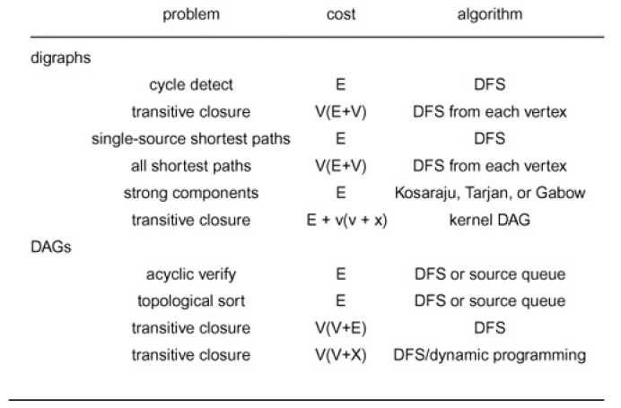

+++

title = "10-Perspective"
weight = 10
+++

### Perspective

Until now we have considered algorithms for solving the topological sort, transitive closure, and shortest paths problems for digraphs and for DAGs, including fundamental algorithms for finding cycles and strong components in digraphs.

Summary of worst case of these algorithms are summarized.

Many other algorithms for processing digraphs and DAGs have important practical application.

**Dominators** Given a DAG with all vertices reachable form a single source $r$, a vertex $s$ dominates a vertex t if every path from r to t contains $s$. (In particular, each vertex dominated itself). Every vertex v other than the next to source has an immediate dominator that dominated v but does not dominate any dominator of $v$ but $v$ and itself.

The set of immediate dominators is a tree that spans all vertices reachable from the source. This structure is important in compiler implementation. The dominator tree can be computed in linear time with a DFS-based approach that uses several ancillary data structures, although a slightly slower version is typically used in practice.

**Transitive Reduction** Given a digraph, is there a directed path connecting two given vertices that uses each edge in the digraphs exactly once ?

**Directed Euler Path** easy and same arguments as for undirected graphs.

**Directed mail Carrier** Given a digraph, find a directed tour with minimal number of edges that uses every edge in graph at least once This problem reduces to mincost-flow problem and is tractable

**Directed Hamilton Path** : NP hard ; but its easy for DAG

**Uniconnected subgraph** A graph is uniconnected if there is at most one directed path between any pair of vertices. Given a digraph an integer $k$, determine whether there is a uniconnected subgraph with at least $k$ edges. This problem is know to be NP-hard for general $k$.

**Feedback vertex set** decide whether a given digraph  has a subset of at most k vertices that contains at least one vertex from every directed cycle in G. This problem is know to be NP-hard.

**Even Cycle** decide whether a given digraph has a cycle of even length. not intractable but quite difficult to solve.