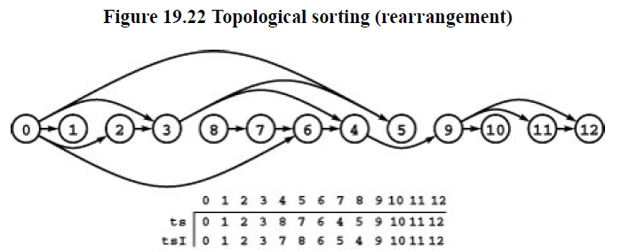
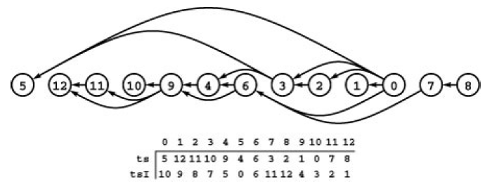

+++

title = "6 Topological Sorting"
weight = 6

+++

### Topological Sorting

Goal of topological sorting is to process the vertices of DAG s.t. every vertex is processed before all the vertices to which it points.

**Topological Sort (relabel)** Given a DAG, relabel its vertices such that every directed edge points from a lower-numbered vertex to a higher-number one.

**Topological Sort (rearrange)** Given a DAG, rearrange its vertices on a horizontal line such that all the directed edges points from left to right.



`for(i = 0; i < V; i++) tsI[ts[i]] = i;` defines a relabeling in the vertex-indexed vector $tsI$.

In general, the vertex order produced by a topological sort is not unique. In scheduling application this situation arises when one task has no direct or indirect dependence on another and thus they can be performed either before or after the other. The number of possible schedules grows exponentially with number of such pairs of tasks.

Sometimes in digraphs we sometimes might interpret edges other way round. This introduces *Reverse Topological sort.*



We already have seen an algorithm for reverse topological sorting: our standard recursive DFS! :)

When input is DAG, a postorder numbering puts vertices in reverse topological order.

**Property 19.11** *Postorder numbering in DFS yields a reverse topological sort for any DAG.*

**Program 19.6 Reverse Topological Sort**

````c++
template<class Dag> class dagTS
{
    const Dag &D;
    int cnt, tcnt;
    vector<int> pre,post,postI;
    void tsR(int v)
    {
        pre[v] = cnt++;
        typename Dag::adjIterator A(D,v);
        for(int t = A.beg(); !A.end(); t = A.nxt())
            if(pre[t] == -1) tsR(t);
        post[v] = tcnt; postI[tcnt++] = v;
    }
    public :
    dagTS(const Dag &D) : D(D), tcnt(0), cntt(0),
    pre(D.V(), -1), post(D.V(), -1) , post(D.V(),-1)
    {
        for(int v = 0; v<D.V(); v++)
            if(pre[v] == -1) tsR(v);
    }
    int operator[] (int v) const { return postI[v];}
    int relabel(int v) const { return post[v];}
};
````

computationally distinction between topological sort and reverse topological sort is not crucial. we simply change `[]` to return `postI[G.V()-1,v]` or we could use a stack as final act of recursion for vertex to be printed.

**Program 19.7 Topological Sort**

````c++
void tsR(int v)
{
    pre[v] = cnt++;
    for(int w = 0 ; w < D.V(); w++)
        if(D.edge(w,v))
            if(pre[w] == -1) tsR(w);
    post[v] = tcnt; postI[tcnt++] = v;
}
````

**Property 19.12** *Every DAG has at least one source and at least one sink.*

we can do topological sorting by removing sources. and we keep track of sources using queues.


