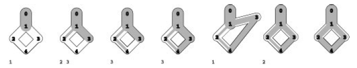
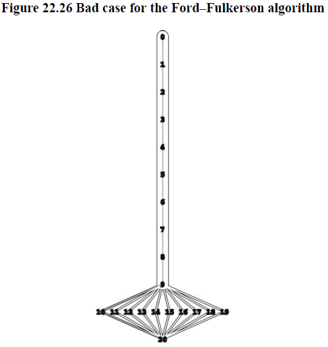

+++

title = "3-preflow push maxflow algorithms"

+++

### Preflow-Push Maxflow Algorithms

using generic method known as the *preflow-push* method, we incrementally move flow along the outgoing edges of vertices that have more inflow than outflow. The preflow-push approach was developed by A. Goldberg and RE Tarjan in 1986 on basis of various earlier algorithms. It is widely used because of its simplicity, flexibility, and efficiency.

An augmenting-path algorithm always maintains a feasible flow : It increase flow along augmenting paths until a maxflow is achieved. By contrast, the preflow-push algorithms that we consider in this section maintain maxflows that are not feasible because some vertices have more inflow than outflow  : They push flow through such vertices have more inflow than outflow  : They push flow through such vertices until a feasible flow is achieved.

**Definition 22.5** In a flow network, a preflow is a set of positive edge flows satisfying the conditions that the flow on each edge is no greater than that edge’s capacity and that inflow is no smaller than  outflow for every internal vertex. An **active** vertex is an internal vertex whose inflow is larger than its outflow (by convention, the source and sink are never active).



vertex' *excess* = active vertex's (*outflow - inflow*)

To change the set of active vertices, we choose one *push* its excess along an outgoing edge and in case of insufficient capacity, push excess back along an incoming edge.

If push equalizes the vertex's inflow and outflow the vertex become inactive; The flow pushed might activate another vertex. The preflow-push method provides a systematic way to push excess out of active vertices repeatedly so that the process terminates in a maxflow, with no active vertices. We keep active vertices on generalized queue.

We keep track of edges that we might push flow through. Every edge in residual network represent a potential place to push flow. If direction of flow same then it adds up to flow otherwise decreases.

**Definition 22.6** A height function for a given flow in a flow network is a set of nonnegative vertex weights h(0)…h(V− 1)such that $h (t)= 0$ for the sink t and $h(u)≤h(v)+1$for every edge u-v in the residual network for the flow. An eligible edge is an edge u-v in the residual network with $h(u)=h(v)+1$.



**Property 22.9** For any flow and associated height function, a vertex’s height is no larger than the length of the shortest path from that vertex to the sink in the residual network.

**Corollary** If a vertex’s height is greater than V, then there is no path from that vertex to the sink in the residual network.

Now we understand the basic mechanism, the generic preflow-push algorithm is simple to describe. Start with any height function and assign zero flow to all edges except those connected to source which we fill to capacity. Then repeat until no active vertices remain

*Choose an active vertex. Push flow through some eligible edge leaving that vertex(if any). If there are no such edges, increment the vertex's height.*

**Property 22.10** The edge-based–preflow-push algorithm preserves the validity of the height function.

all excess flow emanates from source. Informally algorithm tries to push the excess flow back to the source.

**Property 22.11** While the preflow-push algorithm is in execution on a flow network, there exists a (directed) path in that flow network’s residual network from each active vertex to the source, and there are no (directed) paths from source to sink in the residual network.

**Corollary** During the preflow-push algorithm, vertex heights are always less than 2V.

**Property 22.12** The preflow-push algorithm computes a maxflow

Specialized instruction for iteration

*Choose an active vertex. Increase the flow along an eligible edge leaving that vertex (filling it if possible), continuing until the vertex becomes inactive or no eligible edges remain. In the latter case, increment the vertex’s height.*

**Property 22.13** The worst-case running time of the FIFO queue implementation of the preflow-push algorithm is proportional to $V^2E$.


**Program 22.5 Preflow-push maxflow implementation**

````c++
template <class Graph, class Edge> class MAXFLOW
{
  const Graph &G;
    int s,t;
    vector<int> h, wt;
    void initheights();
    public:
    	MAXFLOW(const Graph &G, int s, int t) : G(G),  s(s), t(t), h(G.V()), wt(G.V(),0){
            initheights();
            QQ gQ(G.V());
            gQ.put(s); wt[t] = -(wt[s] = M + G.V());
            while(!gQ.empty())
            {
                int v = gQ.get();
                typename Graph::adjIterator A(G,v);
                for(Edge* e = A.beg(); !A.end(); e = A.nxt())
                {
                    int w = e->other(v);
                    int cap = e->capRto(w);
                    int P = cap < wt[v] ? cap : wt[v];
                    if(P>0 && v == s || h[v] = h[w]+1)
                    {e->addflowRto(v,P);
                	wt[w] -= P; wt[w] +=P;
                     if((w != s) && (w!= t)) gQ.put(v);
                    }
                }
                if(v!=s && v!=t && wt[v] >0)
                {h[v]++; gQ.put(v);}
            }
        }
};
````

To improve performance we might try a stack, a randomized queue or any other generalized queue. Once approach that does well in practice is generalized Queue and return highest active vertex. We refer it as *highest-vertex-preflow-push* maxflow algorithm. A worst-case bound for this algorithm is $V^2 \sqrt E $.

Many other algorithm do better than this and have been proved to be worst-case bound $VE$.

There are many options to explore in developing preflow-push implementation.

- Edge-base v/s vertex-based generic algorithm
- generalized queue implementation
- initial height assignments.

Two generic algorithm that we discussed( *augmenting path and preflow-push*) are among the most important from an extensive research literature on maxflow algorithms.