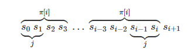

+++

title = "Strings from cp-algorithms"
date = 2021-06-22T12:25:25+05:30
weight = 9

+++

### String Processing

- Fundamentals
  - String Hashing
  - Rabin-Karp
  - Prefix function - KMP
  - Z function
  - Suffix Array
- Advanced
  - Suffix Tree
  - Suffix Automaton
  - Lyndon factorization
- Tasks
  - Expression Parsing
  - Manacher's Algorithm - Finding all sub-palindromes in O(n)
  - Finding repetitions

#### Prefix Function - KMP

Given a string `s` of length `n`. The `prefix function` for this string is defined as an array $\pi [i]$ is the length of proper prefix of substring `s[0...i]` which is also a suffix of this substring. By definition $\pi[0] = 0$.

For example, prefix function of string "abcabcd" is $[0,0,0,1,2,3,0]$

Trivial Algorithm will be of complexity $O(n^3)$.

Efficient Algorithm was proposed by Knuth and Pratt and independently from them by Morris in 1977. It was used as the main function of a substring search algorithm.

- ##### First Optimization

  Observe that the value of the prefix function can increase by at most one.

  i.e. $\pi[i+1] \le \pi[i] + 1$.

  This reduces the complexity to $O(n^2)$.

- ##### Second Optimization

  Lets compute prefix function for $i+1$.

  If $s[i] = s[\pi[i]]$, then we can say with certainty that $\pi[i+1] = \pi[i]+1$, since we already know that the suffix at position $i$ of length $\pi[i]$ is equal to the prefix of length $\pi[i]$.

  If this is not the case, $s[i] \ne s[\pi[i]]$, then we need to try a shorter string. In order to speed up things, we would like to immediately move to the longest length $j < \pi[i]$, such that the prefix property in the position $i$ holds, i.e. $s[0...j-1] = s[i-j+1...i]$.

  

  Indeed, if we find such a length $j$, then we again only need to compare the characters $s[i+1]$ and $s[j]$ , if they equal , then we say $\pi[i+1] = j+1$ otherwise we will need to find the largest value smaller than $j$, for which prefix property holds, and so on. 

  When $j=0$, if $s[i+1] = s[0]$, we assign $\pi[i+1] = 1$ and $\pi[i+1] = 0$ otherwise.

##### Final Algorithm

- Compute prefix values $\pi[i]$ in a loop by iterating from 1... n-1 with $\pi[0] = 0$.
- To calculate the current value $\pi[i]$ we set the j variable the length of best suffix for $i-1$. Initially $j = \pi[i-1]$.
- Test if the suffix of length $j+1$ is also a prefix by comparing $s[j]$ and $s[i]$. If they are equal then we assign $\pi[i] = j+1$ otherwise we reduce $j$ to $\pi[j-1]$ and repeat this step.
- If we have reached $j=0$ and still no match then we set $\pi[i] = 0$ and move on to next index $i+1$.

##### Implementation

````c++
vector<int> prefix_function(string s) {
    int n = (int)s.length();
    vector<int> pi(n);
    for (int i = 1; i < n; i++) {
        int j = pi[i-1];
        while (j > 0 && s[i] != s[j])
            j = pi[j-1];
        if (s[i] == s[j])
            j++;
        pi[i] = j;
    }
    return pi;
}
````

Note : Its a online algorithm, i.e. it processes the data as it arrives.

##### Application

- Substring Searching (KMP)

  given text $t$ and a string $s$, find and display all occurrences of the string $s$ in $t$.

  size of s be n and size of t be m.

  We generate a string s+#+t where # is a separator that doesn't appear in both s and t. Calculate the prefix function for the string.

  This of what prefix function represents for $i > n$. It represents longest length of a substring ending in the position i that coincides with the prefix. But in our cause this is nothing more than the largest block that coincides with $s$ and ends at $i$. This length cannot be bigger than $n$ due to separator. But if equality is approaches $\pi[i] = n$ then it means that the string $s$ appears completely in at this position i.e. it ends at position $i$. Just don't forget indices in string s+#+t.

  If at some $i$ $\pi[i] = n$ then at the position $i-(n+1) - n+1 = i - 2n$ in the string $t$ the string $s$ appears

  Thus KMP solves the problem in $O(n+m)$ time and $O(n)$ memory.

- Counting the number of occurrences of each prefix

  

